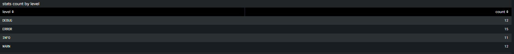
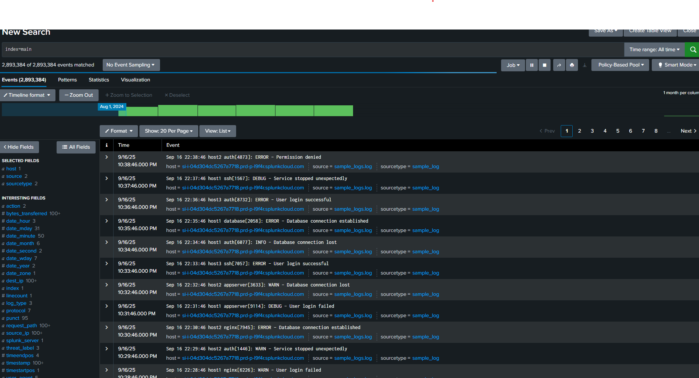
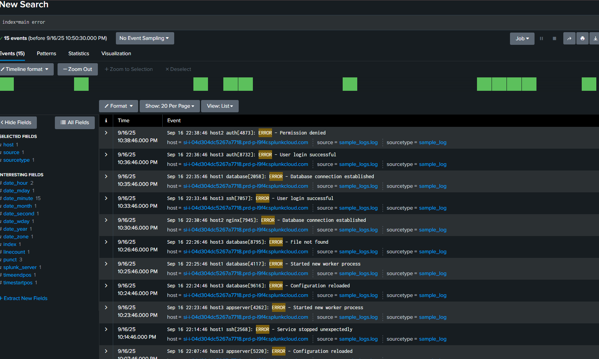
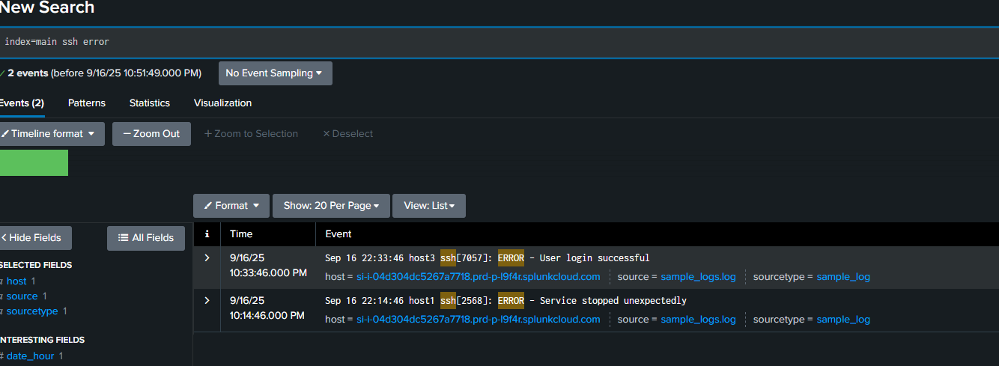
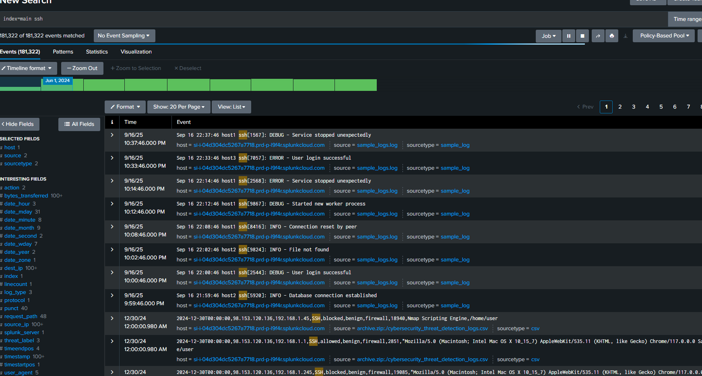

# Splunk Lab 1

This lab demonstrates how I used Splunk to analyze and visualize log data through dashboards and filtered queries.

---

## Dashboards

### Events Over Time by Level

*Shows how events change over time, categorized by severity level (Info, Warn, Error).*

### Event Counts by Service

*Breaks down the number of events generated by each service.*

### Stats Count by Level

*Aggregates events by severity level for a quick overview.*

---

## Logs Analysis

### Raw Log Events

*Unfiltered raw logs collected during the lab.*

### Filtered Logs: WARN

*Logs filtered to only show warnings.*

### Filtered Logs: ERROR

*Logs filtered to only show errors.*

### Filtered Logs: SSH + ERROR

*Focused on SSH-related error events for deeper incident analysis.*

### Filtered Logs: SSH Service

*Shows all SSH service-related logs, including authentication attempts.*
