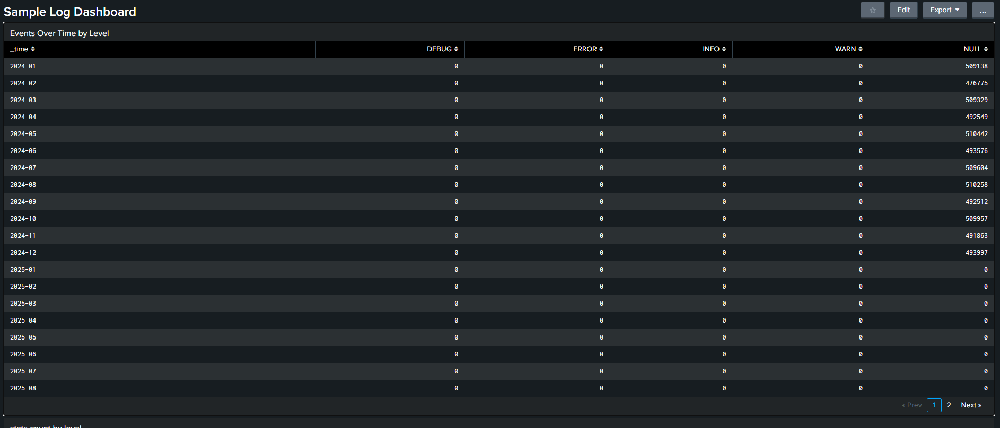
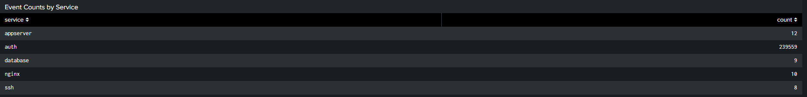
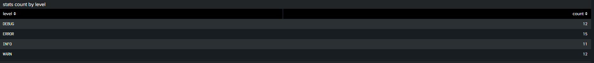
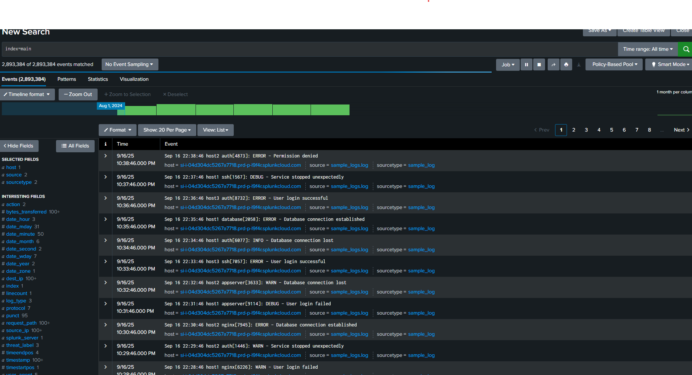
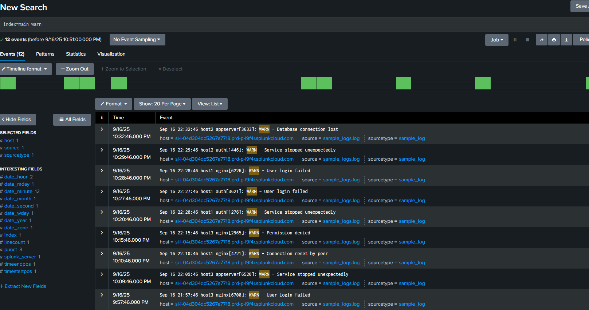
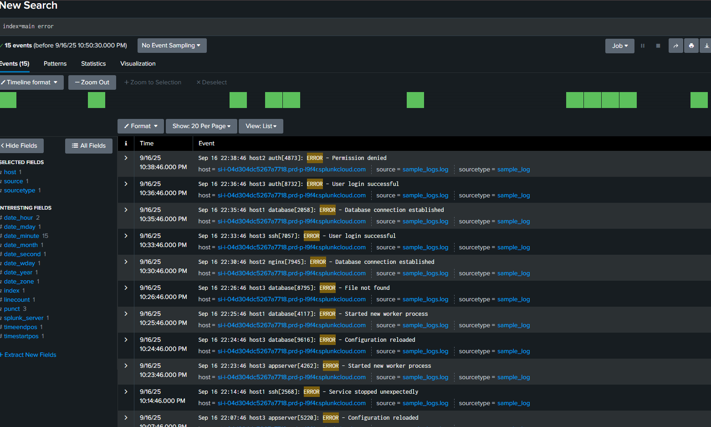

# ✧﹒❀﹒ Splunk Lab 1 ﹒❀﹒✧

This lab demonstrates how I used **Splunk** to analyze and visualize log data through dashboards and filtered queries.

﹒⋆﹒⋄﹒⋆﹒⋄﹒⋆﹒⋄﹒

## Dashboards ✦﹒⟡﹒

### Events Over Time by Level ❶

  

- ⋆ Visualizes how events change over time, categorized by severity level.

### Event Counts by Service ❷

  

- ⋆ Shows the number of events generated by each service.

### Stats Count by Level ❸

  

- ⋆ Aggregates events by severity level for a quick overview.

﹒⋆﹒⋄﹒⋆﹒⋄﹒⋆﹒

## Logs Analysis ✧﹒❖﹒

### Raw Log Events ①

  

- ⋆ Unfiltered raw logs collected during the lab.

### Filtered Logs: WARN ②

  

- ⋆ Logs filtered to only show warnings.

### Filtered Logs: ERROR ③

  

- ⋆ Logs filtered to only show errors.
