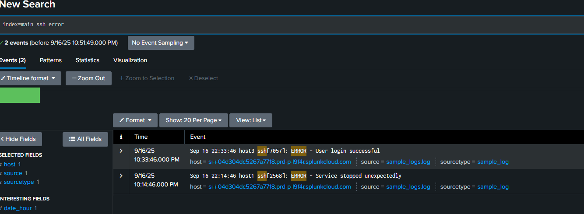
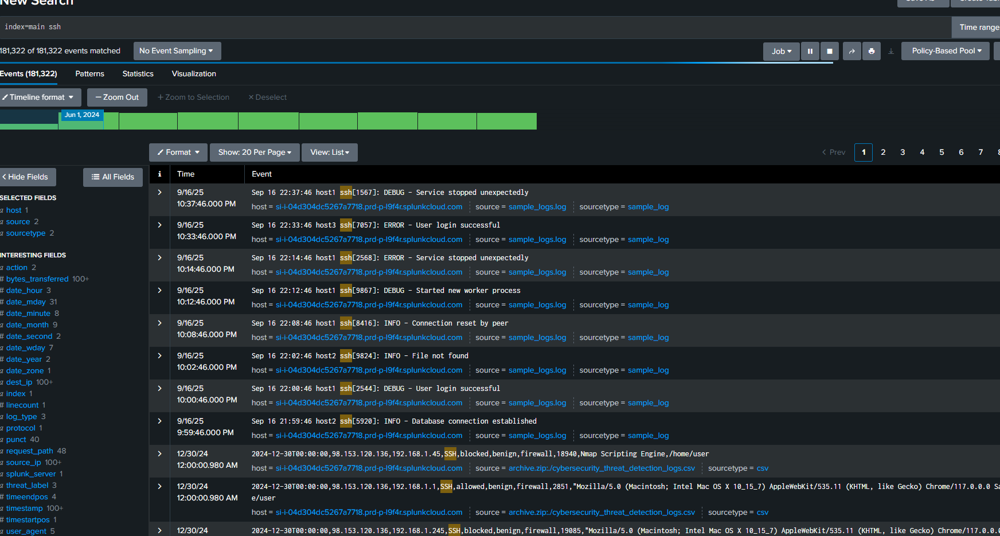

# 🎯 Splunk Lab 1

This lab demonstrates how I used **Splunk** to analyze and visualize log data through dashboards and filtered queries.  

---

## 🗂 Table of Contents
- [📊 Dashboards](#dashboards)
- [📝 Logs Analysis](#logs-analysis)

---

## 📊 Dashboards

### 📈 Events Over Time by Level

  

- 🔹 Visualizes how events change over time, categorized by severity level (Info, Warn, Error).

### 📊 Event Counts by Service

  

- 🔹 Shows the number of events generated by each service.

### 🧮 Stats Count by Level

  

- 🔹 Aggregates events by severity level for a quick overview.

---

## 📝 Logs Analysis

### 🗃 Raw Log Events

  

- 🔹 Unfiltered raw logs collected during the lab.

### ⚠️ Filtered Logs: WARN

  

- 🔹 Logs filtered to only show warnings.

### ❌ Filtered Logs: ERROR

  

- 🔹 Logs filtered to only show errors.

### 🔒 Filtered Logs: SSH + ERROR

  

- 🔹 Focused on SSH-related error events for deeper incident analysis.

### 🖥 Filtered Logs: SSH Service

  

- 🔹 Shows all SSH service-related logs, including authentication attempts.  
